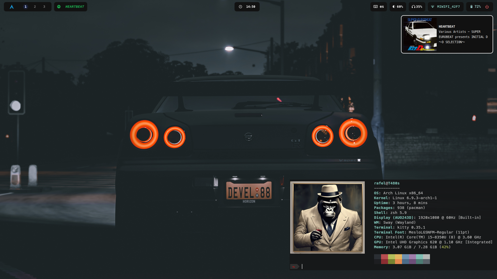
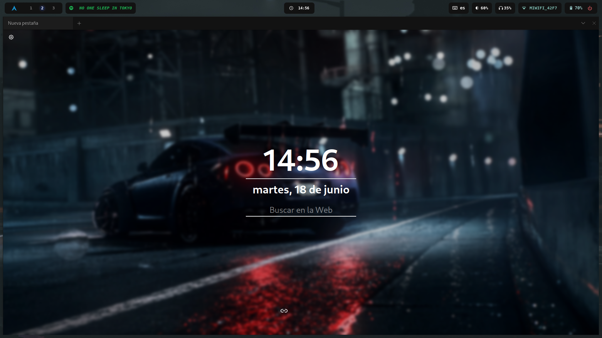
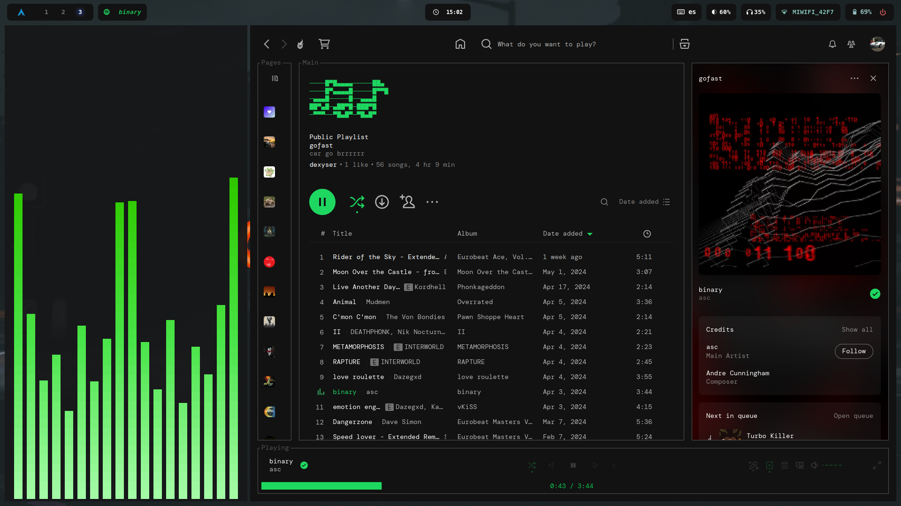
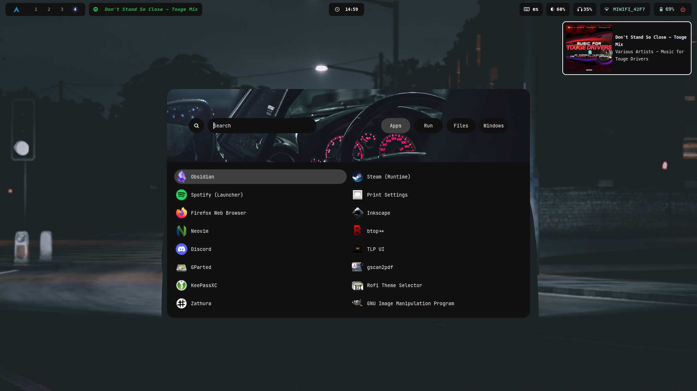
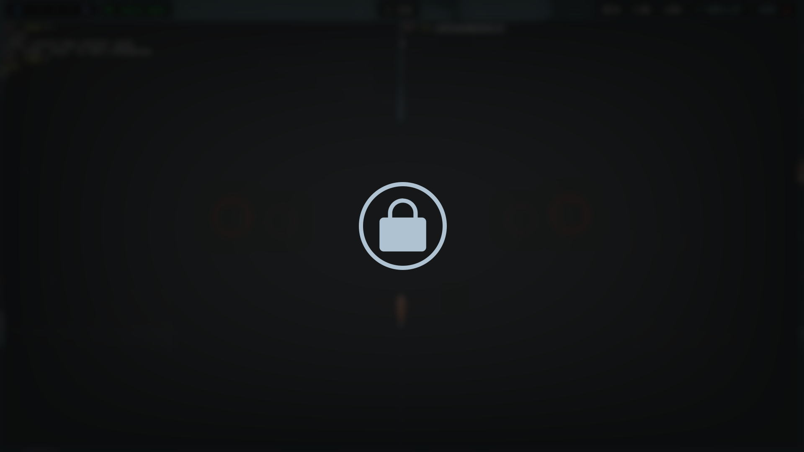
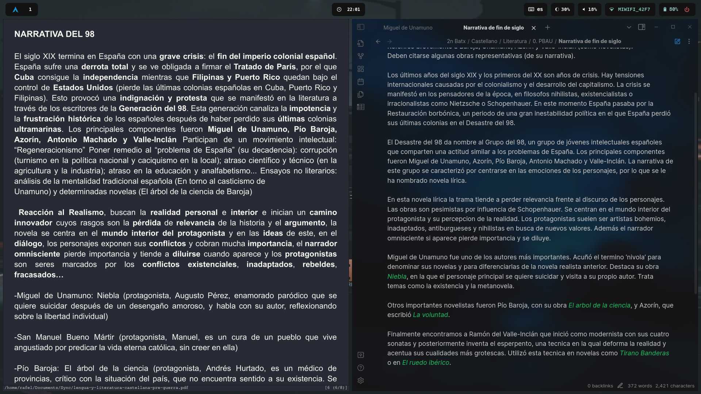

# Dotfiles
- OS: Arch (btw)
- WM: Sway 
- Launcher: Rofi (Wayland)
- Bar: Waybar
- Terminal: Kitty
- File Manager: Nemo/lf
- Text editor: Neovim
- Fetch: Fastfetch
- Shell: zsh 
- Prompt: Powerlevl10k
- Notifications: dunst
- Pdf reader: Zathura
- Lock: [Big-B/swaylock-effects](https://github.com/Big-B/swaylock-fancy)

You can freely copy any of these configs. I have copied many of these myself...

Rofi stuff modified from here: https://github.com/adi1090x/rofi

## Screenshots 

